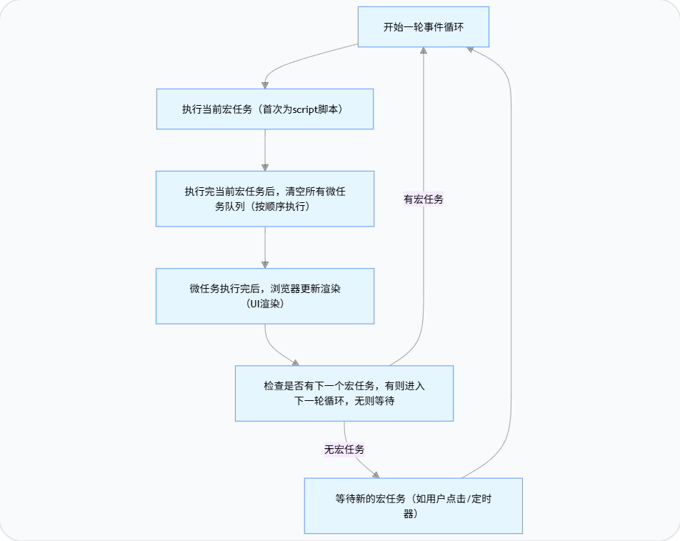

### 事件循环
浏览器或Node.js解决JS单线程运行时异步任务不阻塞主线程的机制。

#### 1：执行 “当前宏任务”（首次为整个 `script` 脚本）
- 主线程先执行 `script` 标签内的**所有同步代码**（这是第一轮循环的 “当前宏任务”）；
- 同步代码执行过程中，遇到异步任务会：
    
    - 宏任务（如 `setTimeout`）：交给浏览器 / Node 的对应线程（定时器线程）处理，到时间后把回调函数加入「宏任务队列」；
    - 微任务（如 `Promise.then`）：直接加入「微任务队列」，等待当前宏任务执行完后执行。

####  2：清空所有微任务队列（按顺序执行）
- 当前宏任务（script）执行完后，立即执行「微任务队列」中的所有微任务（一个接一个，直到队列空）；
- 微任务执行过程中，如果产生新的微任务（如微任务里又调用 `Promise.then`），会**追加到当前微任务队列末尾**，本轮循环一起执行（不会放到下一轮）。

####  3：浏览器更新渲染（仅浏览器环境）
- 微任务执行完后，浏览器会进行一次 DOM 渲染（更新页面）；
- Node.js 环境无此步骤。

####  4：进入下一轮事件循环
- 从「宏任务队列」中取出**第一个宏任务**（如 `setTimeout` 回调），作为 “当前宏任务”；
- 重复步骤 1-3，直到宏任务队列为空。