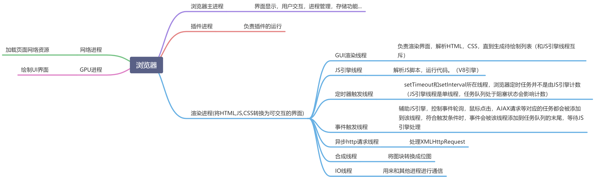

通常浏览器包括以下几个进程
1. **浏览器主进程**
	主要负责界面显示、用户交互、子进程管理，同时提供存储等功能
2. **渲染进程**
	核心任务是将HTML、CSS和JavaScript转换为用户可以与之交互的网页。排版引擎Blink和JavaScript引擎V8都运行在该进程。默认情况下，Chrome浏览器会为每个Tab标签创建一个渲染进程，但如果是从一个页面打开另一个新页面，而新页面和当前页面属于同一个站点的话，则新页面会复用父页面的渲染进程
3. **GPU进程**
	负责把网页的各个部分（图层、图片、视频、动画等）在显卡上快速组合起来，生成最终显示在屏幕上的画面。保证网页里的代码不能直接操作显卡，让浏览器更安全
4. **网络进程**
	主要负责页面的网络资源加载
5. **插件进程**
	主要负责插件的运行，因插件易崩溃，所以需要通过插件进程来隔离，保证插件进程崩溃不会对浏览器和页面造成影响

