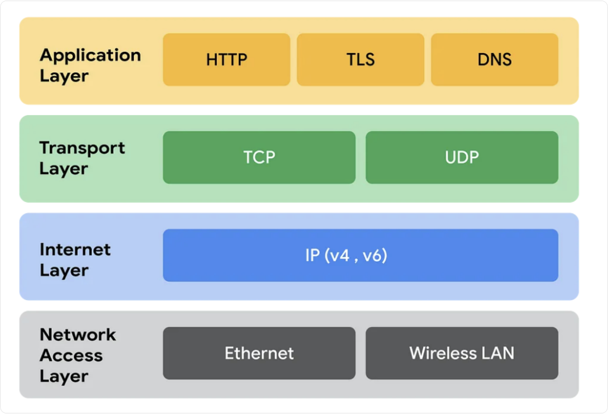

1. 计算机网络体系结构
常见的模型包括 OSI（Open System Interconnection） 七层模型、TCP/IP 四层模型和五层体系结构

OSI 是理论上的网络通信模型，TCP/IP 是实际应用层面上的网络通信模型，五层结构是为了方便理解和记忆。

### OSI七层模型（从低到高）：
OSI用于描述和标准化各种计算机网络的功能和过程

**物理层**（比特流）：主要定义了物理设备的标准，如网线的类型，光纤的接口类型，各种传输介质的传输速率。主要作用是传输比特流（`0101`二进制数据），将比特流转化为电流强弱传输，到达目的后再转化为比特流

**数据链路层**（帧）：在相邻的两台设备之间，通过物理线路可靠地把数据帧安全、正确地传过去

**网络层**（包）：负责在多个网络之间进行数据传输，确保数据能够在复杂的网络结构中找到从源到目的地的最佳路径。这层使用的是IP协议

**传输层**（段）：提供端到端的通信服务，保证数据的完整性和正确顺序。这层需要关注的协议是TCP和UDP

**会话层**：负责建立和断开通信连接，何时建立，断开连接以及保持多久的连接。

**表示层**：确保从一个系统发送的信息可以被另一个系统的应用层读取，解决不同系统之间通信语法问题。负责数据的转换、压缩和加密

**应用层**：最靠近用户的层，负责处理特定的应用程序细节。这一层提供了网络服务与用户应用软件之间的接口，让用户直接操作和使用网络。需要关注HTTP

### TCP/IP四层模型：
TCP/IP四层模型是互联网通信的核心，定义了一系列协议和标准，确保设备间可以可靠地进行数据传输

**应用层**：直接面向用户和应用程序，提供各种网络服务。包含了用于特定应用的协议和服务，如负责web浏览器的HTTP(HyperText Transfer Protocol)，文件传输的FTP(File Transfer Protocol),负责电子邮件的SMTP(Simple Mail Transfer Protocol)，负责域名系统的DNS(Domain Name System)

**传输层**：提供端到端的通信服务，确保数据可靠传输。它负责分段数据、流量控制、错误检测和纠正。主要是有可靠传输的TCP，特别高效的UDP

**网际层**：或者叫网络层，负责在不同网络之间路由数据包，提供逻辑地址（IP地址唯一标识设备）和网络寻址功能。用于处理数据包的分组、转发和路由选择，确保数据可以从源端传输到目标端
常见协议：IPv4、IPv6、ICMP(Internet Control Message Protocol)

**网络接口层**：或者叫链路层，负责将数字信号在网线中准确传输，定义了如何在单一网络链路上传输数据，如何处理数据帧的发送和接收，包括物理地址（MAC地址）的解析

### TCP/IP五层模型：
是对 OSI 和 TCP/IP 的折中，它保留了 TCP/IP 的实用性，同时提供了比四层模型更细致的分层，便于教学和理解网络的各个方面。
- 应用层：作为网络服务和最终用户之间的接口。它提供了一系列供应用程序使用的协议，如 HTTP（网页）、FTP（文件传输）、SMTP（邮件传输）等。使用户的应用程序可以访问网络服务。
- 传输层：提供进程到进程的通信管理，这一层确保数据按顺序、无错误地传输。主要协议包括 TCP 和 UDP。
- 网络层：负责数据包从源到目的地的传输和路由选择，包括跨越多个网络（即互联网）。它使用逻辑地址（如 IP 地址）来唯一标识设备。路由器是网络层设备。
- 数据链路层：确保从一个节点到另一个节点的可靠、有效的数据传输。交换机、网桥是数据链路层设备。
- 物理层：电缆、光纤、无线电频谱、网络适配器等。

2. 数据在各层之间是如何传输的？
对于发送方而言，从上层到下层层层包装，对于接收方而言，从下层到上层，层层解开包装。