# 前端开发模拟面试题 — 安子乐

  

> 本文档模拟真实前端面试流程，共 **45 道题**，覆盖以下模块：

> 1. HTML / CSS（5 题）

> 2. JavaScript 核心（10 题）

> 3. TypeScript（3 题）

> 4. Vue 3 生态（8 题）

> 5. 计算机网络 & 浏览器（7 题）

> 6. 项目经历深挖（12 题）

  

---

  

## 一、HTML / CSS（5 题）

  

### Q1: BFC 是什么？触发条件有哪些？解决了什么问题？

  

**答：**

  

BFC（Block Formatting Context，块级格式化上下文）是 CSS 中一个 **独立的渲染区域**，区域内部元素的布局不会影响外部元素。

  

**触发条件（满足任一即可）：**

- `float` 不为 `none`

- `position` 为 `absolute` 或 `fixed`

- `display` 为 `inline-block`、`flex`、`grid`、`table-cell` 等

- `overflow` 不为 `visible`（常用 `overflow: hidden`）

  

**解决的问题：**

| 问题 | 原理 |

|------|------|

| 外边距折叠（margin collapse） | 不同 BFC 的 margin 不会合并 |

| 浮动元素导致父容器高度塌陷 | BFC 会包含浮动子元素的高度 |

| 浮动元素覆盖兄弟元素 | BFC 区域不会与浮动元素重叠 |

  

---

  

### Q2: Flexbox 和 Grid 布局的区别是什么？各适用于什么场景？

  

**答：**

  

| 维度 | Flexbox | Grid |

|------|---------|------|

| 布局方向 | **一维**（主轴 + 交叉轴） | **二维**（行 + 列） |

| 核心思想 | 内容驱动（由子项大小决定布局） | 容器驱动（先划分网格再放置内容） |

| 适用场景 | 导航栏、按钮组、卡片列表等线性排列 | 整页布局、仪表盘、复杂多行多列布局 |

| 对齐方式 | `justify-content`、`align-items` | `grid-template-rows/columns` + `gap` |

  

**记忆口诀：** "Flex 排一行，Grid 画棋盘"。

  

---

  

### Q3: 如何实现一个元素水平垂直居中？请给出至少三种方案。

  

**答：**

  

```css

/* 方案1: Flex（最常用） */

.parent {

  display: flex;

  justify-content: center;

  align-items: center;

}

  

/* 方案2: Grid */

.parent {

  display: grid;

  place-items: center;

}

  

/* 方案3: 定位 + transform */

.child {

  position: absolute;

  top: 50%;

  left: 50%;

  transform: translate(-50%, -50%);

}

  

/* 方案4: 定位 + margin auto（子元素需有宽高） */

.child {

  position: absolute;

  inset: 0;

  margin: auto;

  width: 100px;

  height: 100px;

}

```

  

---

  

### Q4: 响应式布局有哪些实现方案？你在项目中是怎么做的？

  

**答：**

  

**主流方案：**

1. **媒体查询 `@media`**：根据屏幕宽度设置不同样式断点

2. **弹性布局 `Flexbox` / `Grid`**：自动适配

3. **相对单位**：`rem`、`em`、`vw/vh`、`%`

4. **CSS 容器查询 `@container`**（新特性）：基于父容器尺寸响应

  

**项目实践：** 在智能协作云图库中使用 Ant Design Vue 的栅格系统（`<a-row>` / `<a-col>`）配合 `xs/sm/md/lg/xl` 属性实现响应式，同时用 Flex 布局处理导航栏自适应。

  

---

  

### Q5: CSS 选择器优先级规则是什么？

  

**答：**

  

优先级从高到低：

  

```

!important > 内联样式(1000) > ID 选择器(100) > 类/伪类/属性选择器(10) > 标签/伪元素选择器(1) > 通配符/继承(0)

```

  

**计算方式：** 将每个层级的数量相加比较，**不进位**。例如：

- `#app .container p` → (1, 1, 1) = 100 + 10 + 1 = **111**

- `.nav .item .active` → (0, 3, 0) = 30

  

> ⚠️ 面试追问：相同优先级时，**后声明的覆盖先声明的**。

  

---

  

## 二、JavaScript 核心（10 题）

  

### Q6: 说一下 JavaScript 的事件循环（Event Loop）机制

  

**答：**

  

JavaScript 是单线程语言，通过事件循环处理异步任务。

  

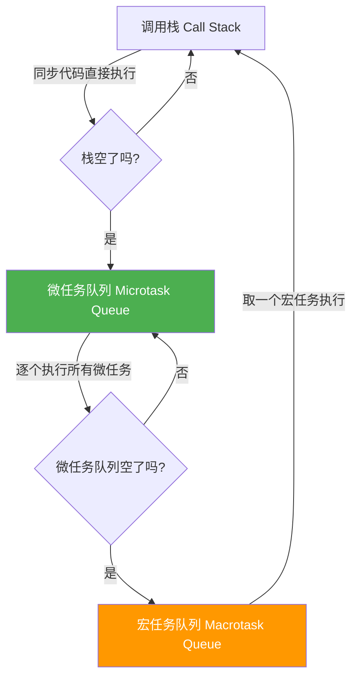

  

**核心规则：**

1. 先执行 **同步代码**（调用栈）

2. 栈清空后，清空 **所有微任务**（Promise.then、MutationObserver、queueMicrotask）

3. 取出 **一个宏任务** 执行（setTimeout、setInterval、I/O、UI 渲染）

4. 回到步骤 2，循环往复

  

**经典考题输出顺序：**

```javascript

console.log('1');           // 同步

setTimeout(() => console.log('2'), 0);  // 宏任务

Promise.resolve().then(() => console.log('3'));  // 微任务

console.log('4');           // 同步

// 输出: 1 → 4 → 3 → 2

```

  

---

  

### Q7: 请解释原型链（Prototype Chain），并画图说明

  

**答：**

  

每个对象都有一个 `__proto__` 属性指向其构造函数的 `prototype`，形成链式结构。当访问一个属性时，会沿着原型链向上查找。

  

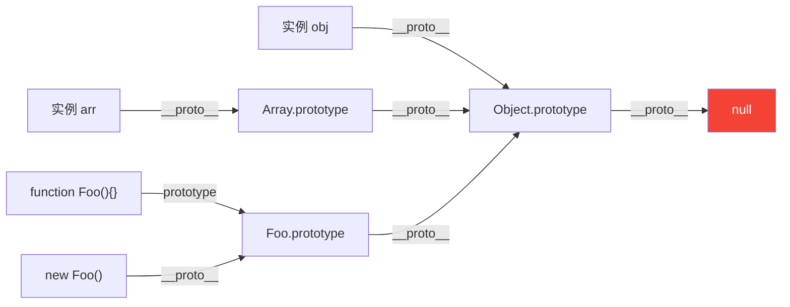

  

**关键公式：**

```javascript

instance.__proto__ === Constructor.prototype  // ✅

Constructor.prototype.__proto__ === Object.prototype  // ✅

Object.prototype.__proto__ === null  // ✅ 链终点

```

  

---

  

### Q8: 闭包是什么？有哪些应用场景？会造成什么问题？

  

**答：**

  

**定义：** 闭包 = 函数 + 其创建时的词法环境。内部函数引用了外部函数的变量，即使外部函数已执行完毕，变量仍不会被回收。

  

**应用场景：**

1. **防抖/节流**（简历中提到过）

2. **数据私有化**（模块模式）

3. **柯里化**

4. **回调函数保持对外部状态的引用**

  

**防抖示例（你简历提到能手写）：**

```javascript

function debounce(fn, delay) {

  let timer = null; // 闭包保持 timer 引用

  return function (...args) {

    clearTimeout(timer);

    timer = setTimeout(() => {

      fn.apply(this, args);

    }, delay);

  };

}

```

  

**可能造成的问题：** 内存泄漏——被引用的变量无法被 GC 回收。解决方法是在不需要时手动解除引用（`= null`）。

  

---

  

### Q9: this 的绑定规则有哪些？优先级是什么？

  

**答：**

  

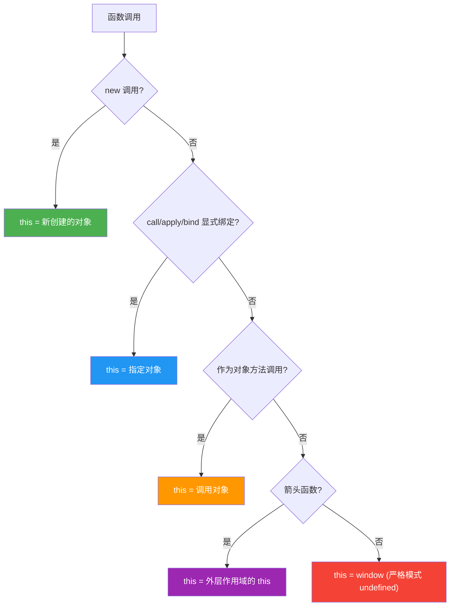

  

**优先级：** `new绑定 > 显式绑定 > 隐式绑定 > 默认绑定`

  

> ⚠️ 项目关联：在 Vue 3 组合式 API 中较少遇到 this 问题，因为 `setup()` 中不使用 this。但在选项式 API 中，methods 里的 this 指向组件实例。

  

---

  

### Q10: 深拷贝和浅拷贝的区别？请手写一个深拷贝

  

**答：**

  

| 对比项 | 浅拷贝 | 深拷贝 |

|--------|--------|--------|

| 复制层级 | 只复制第一层 | 递归复制所有层 |

| 引用关系 | 内层对象仍共享引用 | 完全独立 |

| 常见方法 | `Object.assign()`、展开运算符 `{...obj}` | `JSON.parse(JSON.stringify())`、手写递归 |

  

**手写深拷贝（处理循环引用）：**

```javascript

function deepClone(obj, map = new WeakMap()) {

  if (obj === null || typeof obj !== 'object') return obj;

  if (obj instanceof Date) return new Date(obj);

  if (obj instanceof RegExp) return new RegExp(obj);

  // 处理循环引用

  if (map.has(obj)) return map.get(obj);

  const clone = Array.isArray(obj) ? [] : {};

  map.set(obj, clone);

  for (const key in obj) {

    if (obj.hasOwnProperty(key)) {

      clone[key] = deepClone(obj[key], map);

    }

  }

  return clone;

}

```

  

**`JSON.parse(JSON.stringify())` 的缺陷：** 无法处理 `undefined`、`Function`、`Symbol`、`Date`（变字符串）、`RegExp`（变 `{}`）、循环引用（报错）。

  

---

  

### Q11: var、let、const 的区别？什么是暂时性死区（TDZ）？

  

**答：**

  

| 特性 | `var` | `let` | `const` |

|------|-------|-------|---------|

| 作用域 | 函数作用域 | 块级作用域 | 块级作用域 |

| 变量提升 | ✅ 提升并初始化为 `undefined` | ✅ 提升但**不初始化**（TDZ） | ✅ 提升但**不初始化**（TDZ） |

| 重复声明 | ✅ 允许 | ❌ 报错 | ❌ 报错 |

| 修改赋值 | ✅ | ✅ | ❌（但对象属性可改） |

  

**暂时性死区（TDZ）：** 从代码块开始到 `let/const` 声明语句之间的区域，在这个区域中访问该变量会抛出 `ReferenceError`。

  

```javascript

console.log(a); // undefined (var 提升)

var a = 1;

  

console.log(b); // ❌ ReferenceError (TDZ)

let b = 2;

```

  

---

  

### Q12: 说一下 Promise、async/await，以及他们的错误处理

  

**答：**

  

**Promise 三种状态：** `pending` → `fulfilled` / `rejected`（不可逆）

  

**核心 API：**

- `Promise.all()`：全部成功或任一失败

- `Promise.race()`：第一个完成的（无论成功/失败）

- `Promise.allSettled()`：全部完成（不管成功失败）

- `Promise.any()`：第一个成功（所有失败才报错）

  

**async/await** 是 Promise 的语法糖，让异步代码看起来像同步。

  

**错误处理：**

```javascript

// Promise 链式

fetchData()

  .then(data => process(data))

  .catch(err => console.error(err));

  

// async/await

async function getData() {

  try {

    const data = await fetchData();

    return process(data);

  } catch (err) {

    console.error(err);

  }

}

```

  

> 项目关联：你在 AI 应用生成助手中使用 SSE + EventSource 处理流式数据，这本身也涉及异步数据流的处理。

  

---

  

### Q13: 说一下垃圾回收机制（GC）

  

**答：**

  

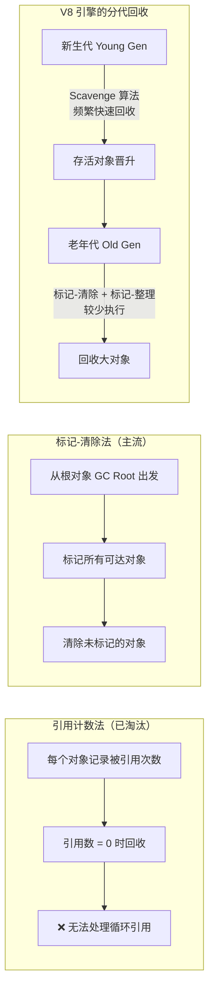

  

**V8 分代回收策略：**

- **新生代**：存放短生命周期对象，使用 Scavenge 算法（空间换时间）

- **老年代**：存放长生命周期对象，使用 标记-清除 + 标记-整理

  

**常见内存泄漏场景：**

1. 未清除的定时器 / 事件监听器

2. 闭包引用大对象

3. 脱离 DOM 的引用

4. 全局变量

  

---

  

### Q14: 节流（throttle）和防抖（debounce）的区别？手写节流

  

**答：**

  

| 对比项 | 防抖 debounce | 节流 throttle |

|--------|---------------|---------------|

| 触发时机 | 最后一次触发后延迟执行 | 固定时间间隔内只执行一次 |

| 适用场景 | 搜索框输入、窗口 resize | 滚动事件、按钮点击 |

| 形象比喻 | 电梯关门：有人进来就重新计时 | 水龙头滴水：固定频率滴一滴 |

  

**手写节流（时间戳版）：**

```javascript

function throttle(fn, interval) {

  let lastTime = 0;

  return function (...args) {

    const now = Date.now();

    if (now - lastTime >= interval) {

      lastTime = now;

      fn.apply(this, args);

    }

  };

}

```

  

---

  

### Q15: 说一下 ES6+ 的新特性，项目中常用哪些？

  

**答：**

  

**高频使用：**

1. **解构赋值**：`const { data } = response`

2. **箭头函数**：`() => {}`（不绑定自己的 this）

3. **模板字符串**：`` `Hello, ${name}` ``

4. **展开运算符**：`{...obj}`、`[...arr]`

5. **Promise / async-await**：处理异步

6. **`let` / `const`**：块级作用域变量

7. **可选链 `?.`**：`user?.address?.city`

8. **空值合并 `??`**：`value ?? defaultValue`

9. **`Map` / `Set`**：新的数据结构

10. **ES Module**：`import / export`

  

**项目使用示例：** 在云图库项目中大量使用解构赋值获取 API 响应数据、可选链安全访问嵌套属性、async/await 处理异步请求。

  

---

  

## 三、TypeScript（3 题）

  

### Q16: TypeScript 中 `interface` 和 `type` 有什么区别？

  

**答：**

  

| 对比项 | `interface` | `type` |

|--------|-------------|--------|

| 扩展方式 | `extends` 继承 | `&` 交叉类型 |

| 重复声明 | ✅ 自动合并（声明合并） | ❌ 报错 |

| 适用范围 | 主要用于对象类型 | 支持联合类型、元组、基元别名等 |

| 使用场景 | 定义 API 返回类型、组件 props | 定义联合类型、工具类型 |

  

**最佳实践：** 优先使用 `interface` 定义对象结构，用 `type` 定义联合类型和复杂类型运算。

  

```typescript

// interface: API 响应结构

interface ApiResponse<T> {

  code: number;

  data: T;

  message: string;

}

  

// type: 联合类型

type Status = 'success' | 'error' | 'loading';

```

  

---

  

### Q17: TypeScript 中的泛型是什么？怎么用？

  

**答：**

  

泛型是**类型的参数化**，让函数/类/接口在定义时不指定具体类型，在使用时再传入。

  

```typescript

// 泛型函数

function identity<T>(arg: T): T {

  return arg;

}

  

// 泛型约束

function getLength<T extends { length: number }>(arg: T): number {

  return arg.length;

}

  

// 泛型在项目中的实际应用：封装 API 请求

async function request<T>(url: string): Promise<ApiResponse<T>> {

  const res = await axios.get(url);

  return res.data;

}

  

// 调用时指定类型

const pictures = await request<PictureVO[]>('/api/picture/list');

```

  

> 项目关联：你在项目中使用 OpenAPI 自动生成的类型定义，这些 TypeScript 模型就大量使用泛型来保证请求和响应的类型安全。

  

---

  

### Q18: 说一下 TypeScript 的常用工具类型

  

**答：**

  

| 工具类型 | 作用 | 示例 |

|----------|------|------|

| `Partial<T>` | 所有属性变为可选 | `Partial<User>` |

| `Required<T>` | 所有属性变为必填 | `Required<Config>` |

| `Pick<T, K>` | 从 T 中选取部分属性 | `Pick<User, 'name' \| 'age'>` |

| `Omit<T, K>` | 从 T 中排除部分属性 | `Omit<User, 'password'>` |

| `Record<K, V>` | 键为 K，值为 V 的对象 | `Record<string, number>` |

| `ReturnType<T>` | 获取函数返回值类型 | `ReturnType<typeof fn>` |

  

---

  

## 四、Vue 3 生态（8 题）

  

### Q19: Vue 3 的响应式原理是什么？和 Vue 2 有什么区别？

  

**答：**

  

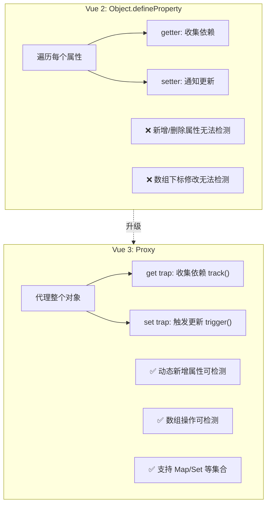

  

**核心差异：**

| 对比项 | Vue 2 | Vue 3 |

|--------|-------|-------|

| 底层实现 | `Object.defineProperty` | `Proxy` |

| 初始化 | 递归遍历所有属性 | 惰性代理（访问时才递归） |

| 新增属性 | 需要 `Vue.set()` | 自动检测 |

| 性能 | 初始化开销大 | 更好的性能 |

  

---

  

### Q20: 说一下 Vue 3 的组合式 API（Composition API）有什么优势？

  

**答：**

  

**对比选项式 API 的问题：** 一个逻辑关注点的代码分散在 `data`、`methods`、`computed`、`watch` 等选项中，随着组件膨胀难以维护。

  

**组合式 API 优势：**

1. **逻辑复用**：通过 `composable`（自定义 Hook）轻松复用逻辑，替代 Mixin

2. **代码组织**：相关逻辑集中在一起，而非按选项类型分散

3. **更好的 TypeScript 支持**：纯函数式写法，类型推断更自然

4. **Tree-shaking 友好**：按需引入 `ref`/`reactive`/`computed` 等

  

**项目中的使用：** 在云图库项目中通过 `useStore()` 访问 Pinia 状态，组合登录逻辑、权限逻辑到各组件。

  

---

  

### Q21: ref 和 reactive 的区别是什么？怎么选择？

  

**答：**

  

| 对比项 | `ref` | `reactive` |

|--------|-------|------------|

| 适用类型 | 任意类型（基本类型 + 对象） | 仅对象类型 |

| 访问方式 | 模板中自动解包，JS 中需 `.value` | 直接访问 |

| 解构 | 不受影响 | ❌ 解构会丢失响应式 |

| 替换整个值 | ✅ `ref.value = newValue` | ❌ 不能替换整体 |

  

**选择建议：**

- 基本类型 → `ref`

- 表单对象、API 返回的复杂数据 → `reactive`

- **不确定时用 `ref`**（更通用）

  

---

  

### Q22: Vue Router 的导航守卫有哪些？你在项目中怎么使用？

  

**答：**

  

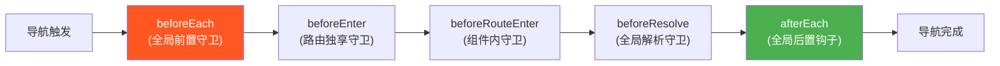

  

**项目实践（云图库权限控制）：**

```typescript

// router/index.ts - 全局前置守卫

router.beforeEach((to, from, next) => {

  const userStore = useUserStore();

  // 1. 检查路径前缀：/admin 开头的路由需要管理员权限

  if (to.path.startsWith('/admin')) {

    if (userStore.role !== 'admin') {

      return next('/403');

    }

  }

  // 2. 需登录页面：未登录则跳转登录页

  if (to.meta.requiresAuth && !userStore.isLoggedIn) {

    return next('/login');

  }

  next();

});

```

  

你在简历中提到 **"路径前缀 + 角色校验"** 的方案，封装 `access.ts` 模块集中处理。

  

---

  

### Q23: Pinia 和 Vuex 的区别是什么？为什么选 Pinia？

  

**答：**

  

| 对比项 | Vuex | Pinia |

|--------|------|-------|

| API 风格 | `state/getters/mutations/actions` | `state/getters/actions`（去掉 mutations） |

| TypeScript | 支持较弱 | 原生支持，类型推断好 |

| 模块化 | `modules` + `namespaced` | 每个 Store 独立，无需嵌套 |

| 体积 | 较大 | 1KB 左右 |

| Devtools | 支持 | 支持 |

  

**选择 Pinia 的原因：**

1. 去掉 mutations，简化状态修改流程

2. 与 Vue 3 组合式 API 风格一致

3. 完美的 TypeScript 支持

4. 更轻量

  

---

  

### Q24: Vue 3 的生命周期钩子有哪些？

  

**答：**

  

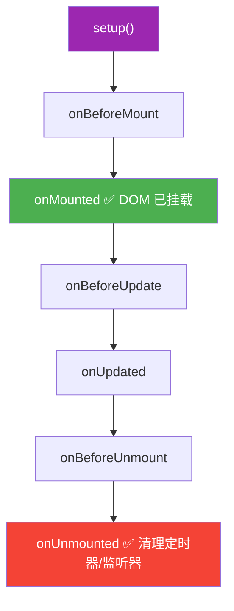

  

**常见使用场景：**

- `onMounted`：发起 API 请求、初始化第三方库、操作 DOM

- `onUnmounted`：清理定时器、解绑事件监听、关闭 WebSocket 连接

- `onUpdated`：DOM 更新后的操作（注意避免死循环）

  

---

  

### Q25: watch 和 watchEffect 的区别？

  

**答：**

  

| 对比项 | `watch` | `watchEffect` |

|--------|---------|---------------|

| 数据源 | 需显式指定监听目标 | 自动收集依赖 |

| 旧值 | 可获取 `(newVal, oldVal)` | 获取不到 |

| 立即执行 | 默认否（可设 `immediate: true`） | ✅ 立即执行一次 |

| 适用场景 | 监听特定数据变化并执行副作用 | 自动追踪多个响应式依赖 |

  

```typescript

// watch: 精确控制

watch(() => route.params.id, (newId) => {

  fetchData(newId);

});

  

// watchEffect: 自动追踪

watchEffect(() => {

  // 自动追踪 searchText 和 pageNum 的变化

  fetchPictures(searchText.value, pageNum.value);

});

```

  

---

  

### Q26: Vue 3 中组件通信有哪些方式？

  

**答：**

  

| 方式 | 方向 | 适用场景 |

|------|------|----------|

| `props / emits` | 父 ↔ 子 | 最常用的父子通信 |

| `v-model` | 父 ↔ 子 | 表单组件双向绑定 |

| `provide / inject` | 祖先 → 后代 | 跨层级传递（避免 prop drilling） |

| `Pinia` | 全局 | 跨组件共享全局状态 |

| `事件总线 mitt` | 任意 | 非父子组件通信（少用） |

| `ref + expose` | 父 → 子 | 父组件调用子组件方法 |

  

---

  

## 五、计算机网络 & 浏览器（7 题）

  

### Q27: HTTP 和 HTTPS 的区别？HTTPS 的握手过程？

  

**答：**

  

| 对比项 | HTTP | HTTPS |

|--------|------|-------|

| 端口 | 80 | 443 |

| 安全性 | 明文传输 | SSL/TLS 加密 |

| 证书 | 不需要 | 需要 CA 证书 |

| 性能 | 快 | 多一次握手，略慢 |

  

**TLS 握手流程：**

  

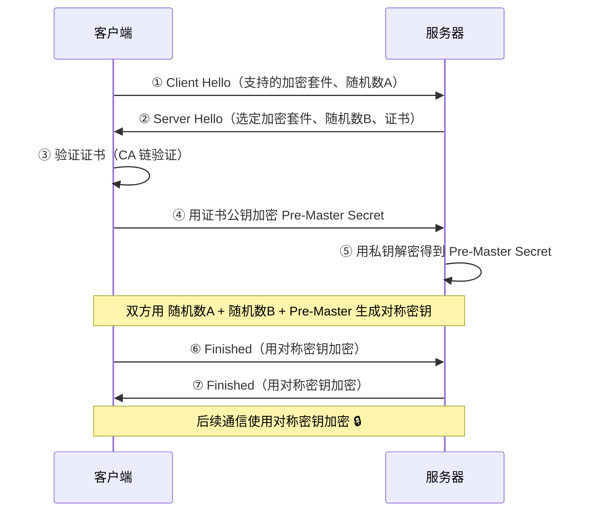

  

---

  

### Q28: 说一下 HTTP 缓存机制（强缓存 & 协商缓存）

  

**答：**

  

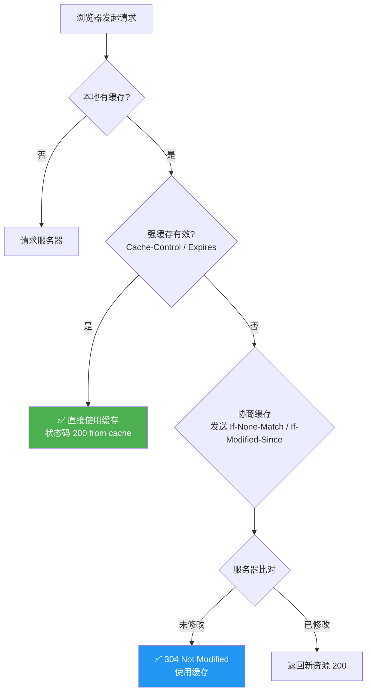

  

**关键字段：**

| 阶段 | 请求头 | 响应头 |

|------|--------|--------|

| 强缓存 | — | `Cache-Control: max-age=31536000` |

| 协商缓存 | `If-None-Match` | `ETag: "abc123"` |

| 协商缓存 | `If-Modified-Since` | `Last-Modified: ...` |

  

**优先级：** `Cache-Control` > `Expires`；`ETag` > `Last-Modified`。

  

---

  

### Q29: 浏览器输入 URL 到页面渲染的完整过程

  

**答：**

  

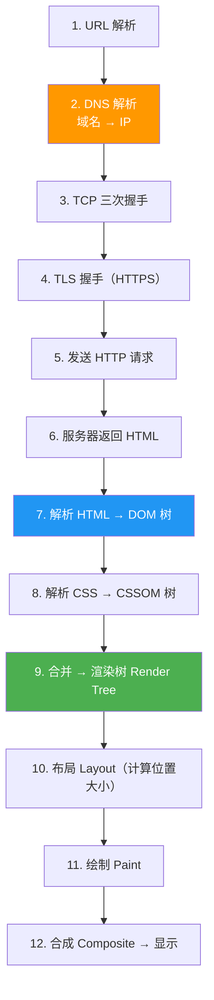

  

**追问要点：**

- DNS 解析有缓存层级：浏览器缓存 → OS 缓存 → 路由器 → ISP → 根域名服务器

- `<script>` 会阻塞 DOM 解析（`async` / `defer` 解决）

- 回流（Reflow）vs 重绘（Repaint）：回流必引发重绘，重绘不一定回流

  

---

  

### Q30: 什么是跨域？怎么解决？

  

**答：**

  

**同源策略：** 浏览器限制不同 **协议 + 域名 + 端口** 的资源访问。

  

**解决方案：**

1. **CORS（最常用）**：服务端设置 `Access-Control-Allow-Origin` 响应头

2. **代理服务器**：开发环境配置 Vite 的 `proxy`，生产环境用 Nginx 反代

3. **JSONP**：利用 `<script>` 标签不受同源策略限制（仅支持 GET，基本淘汰）

4. **postMessage**：跨窗口通信（你在项目中使用过！）

  

**项目中的实践：**

```typescript

// vite.config.ts 开发环境代理

export default defineConfig({

  server: {

    proxy: {

      '/api': {

        target: 'http://localhost:8080',

        changeOrigin: true,

      }

    }

  }

});

```

  

---

  

### Q31: 说一下常见的 HTTP 状态码

  

**答：**

  

| 状态码 | 含义 | 常见场景 |

|--------|------|----------|

| **200** | 成功 | 正常请求 |

| **204** | 成功但无返回体 | DELETE 请求 |

| **301** | 永久重定向 | 域名更换 |

| **302** | 临时重定向 | 登录跳转 |

| **304** | 资源未修改 | 协商缓存命中 |

| **400** | 请求参数错误 | 表单验证失败 |

| **401** | 未认证 | 未登录 |

| **403** | 无权限 | 权限不足 |

| **404** | 资源不存在 | URL 错误 |

| **500** | 服务器内部错误 | 后端代码异常 |

| **502** | 网关错误 | Nginx 后端挂了 |

| **503** | 服务不可用 | 服务器过载/维护 |

  

---

  

### Q32: GET 和 POST 的区别？

  

**答：**

  

| 对比项 | GET | POST |

|--------|-----|------|

| 参数位置 | URL 中（Query String） | 请求体中（Body） |

| 长度限制 | 受 URL 长度限制（约 2KB） | 理论上无限制 |

| 缓存 | ✅ 会被浏览器缓存 | ❌ 不缓存 |

| 安全性 | 参数暴露在 URL | 相对安全（但仍非加密） |

| 幂等性 | ✅ 幂等（多次请求结果相同） | ❌ 非幂等 |

| 语义 | 获取资源 | 提交数据/创建资源 |

  

> ⚠️ 本质上 GET 和 POST 都是 HTTP 请求，从 TCP 层面没有本质区别，以上差异更多是**规范约束和浏览器行为**。

  

---

  

### Q33: 什么是 XSS 和 CSRF 攻击？如何防御？

  

**答：**

  

**XSS（跨站脚本攻击）：**

- 攻击者注入恶意脚本到页面中执行

- 类型：存储型、反射型、DOM 型

- 防御：输入转义、CSP（Content Security Policy）、HttpOnly Cookie

  

**CSRF（跨站请求伪造）：**

- 利用用户已登录的状态，伪造请求

- 防御：Token 验证、SameSite Cookie、Referer 检查

  

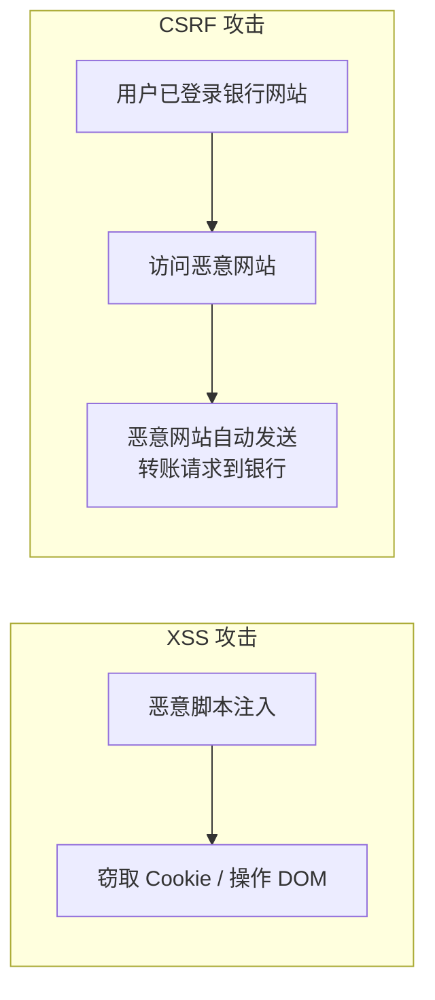

  

---

  

## 六、项目经历深挖（12 题）

  

### Q34: 你的云图库项目中 WebSocket 协同编辑是怎么实现的？"编辑锁"机制具体是什么？

  

**答：**

  

**整体架构：**

  

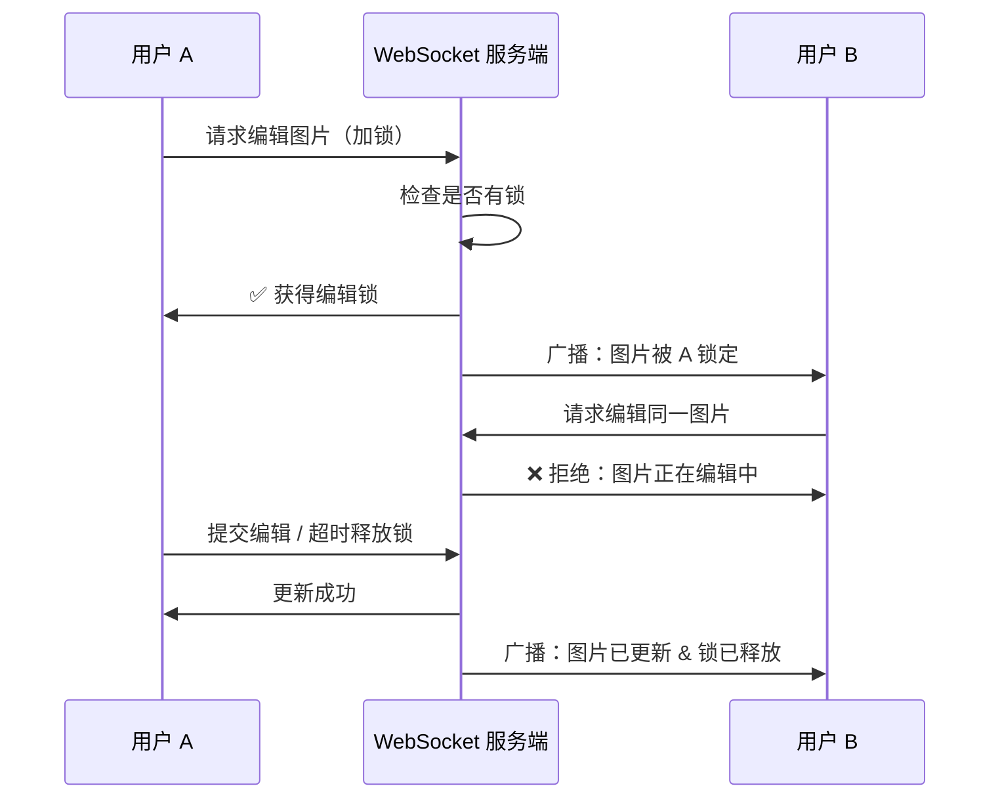

  

**编辑锁机制：**

1. 用户点击"编辑"时向后端发送加锁请求

2. 后端检测该资源是否已被其他用户锁定

3. 获取锁 → 进入编辑模式；锁被占用 → 提示"该资源正在被编辑"

4. 编辑完成或超时自动释放锁

5. 状态变化通过 WebSocket **实时广播**给同空间的所有用户

  

**前端建立 WebSocket 连接的方式：**

```typescript

const ws = new WebSocket(`ws://xxx/api/ws/picture/${spaceId}`);

ws.onmessage = (event) => {

  const message = JSON.parse(event.data);

  // 处理不同事件类型：LOCK、UNLOCK、UPDATE

};

```

  

---

  

### Q35: SSE（Server-Sent Events）是什么？和 WebSocket 有什么区别？你在 AI 应用助手中是怎么用的？

  

**答：**

  

| 对比项 | SSE | WebSocket |

|--------|-----|-----------|

| 通信方向 | **单向**（服务器 → 客户端） | **双向** |

| 协议 | 基于 HTTP | 独立的 ws:// 协议 |

| 自动重连 | ✅ 内置 | ❌ 需手动实现 |

| 数据格式 | 文本（text/event-stream） | 文本 或 二进制 |

| 适用场景 | AI 流式响应、实时通知 | 聊天、协同编辑 |

  

**项目使用：**

```typescript

// 使用 EventSource 接收 AI 流式响应

const eventSource = new EventSource(`/api/app/chat?appId=${id}&message=${msg}`);

  

eventSource.onmessage = (event) => {

  // 每次收到一个 chunk，追加到消息中，实现打字机效果

  chatContent.value += event.data;

};

  

eventSource.addEventListener('error', (event) => {

  // 自定义事件处理业务异常

  handleError(event);

  eventSource.close();

});

  

eventSource.addEventListener('done', () => {

  eventSource.close();

});

```

  

**为什么 AI 场景选 SSE 而不是 WebSocket？** 因为 AI 生成是 **单向流**（服务器持续输出），不需要客户端向服务器发送消息。SSE 基于 HTTP，更简单、自带重连、无需额外协议升级。

  

---

  

### Q36: 你是怎么用 postMessage 实现 iframe 跨窗口通信的？

  

**答：**

  

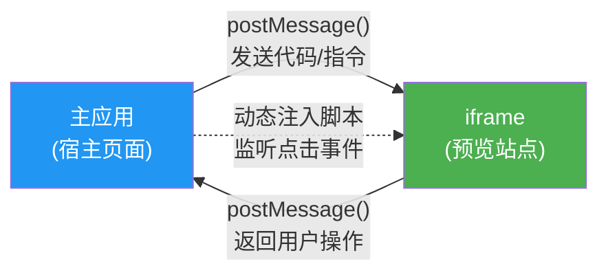

  

**具体实现：**

1. **主应用向 iframe 发送消息：**

```typescript

const iframe = document.querySelector('iframe');

// 发送 AI 生成的 HTML 到 iframe 中渲染

iframe.contentWindow.postMessage({

  type: 'UPDATE_CODE',

  html: generatedHtml

}, '*');

```

  

2. **动态注入监听脚本到 iframe：**

```typescript

// 向 iframe 注入点击监听脚本

const script = `

  document.addEventListener('click', (e) => {

    const path = getElementPath(e.target);

    window.parent.postMessage({

      type: 'ELEMENT_CLICKED',

      selector: path

    }, '*');

  });

`;

```

  

3. **主应用接收 iframe 消息：**

```typescript

window.addEventListener('message', (event) => {

  if (event.data.type === 'ELEMENT_CLICKED') {

    // 高亮对应元素，显示可视化编辑面板

    showEditor(event.data.selector);

  }

});

```

  

**安全注意事项：** 生产中应指定 `targetOrigin` 而非 `'*'`，且在 `message` 事件中验证 `event.origin`。

  

---

  

### Q37: 说一下你项目中前端精度丢失问题是怎么排查的？

  

**答：**

  

**问题背景：** 后端返回的 ID 是 Java `Long` 类型（最大 2^63），而 JavaScript 的 `Number` 类型使用 IEEE 754 双精度浮点数，安全整数范围仅为 `±2^53 - 1`（即 `Number.MAX_SAFE_INTEGER = 9007199254740991`）。超过此范围的整数会丢失精度。

  

**排查过程：**

1. 前端数据展示异常 → 打开 DevTools Network 面板查看原始响应：ID 正确

2. 在 Console 中打印解析后的对象：ID 末尾几位变为 0 → 确认是 **JSON 解析阶段** 精度丢失

3. 定位到 Axios 响应拦截器中 `JSON.parse()` 的过程

  

**解决方案：** 后端配置 Jackson 序列化，将 `Long` 类型序列化为 **String**。

```java

// 后端 Jackson 配置

@JsonSerialize(using = ToStringSerializer.class)

private Long id;

```

  

前端不需要改动，收到的 ID 变成字符串后不存在精度问题。

  

---

  

### Q38: OpenAPI 自动生成 TypeScript 代码是怎么做的？有什么好处？

  

**答：**

  

**流程：**

1. 后端使用 Swagger/Knife4j 注解生成 API 文档 → 暴露 `openapi.json`

2. 前端使用 `openapi-typescript-codegen` 等工具，根据 `openapi.json` **自动生成**：

   - TypeScript 类型定义（`typings.d.ts`）

   - API 请求函数（`xxxController.ts`）

  

```bash

# 命令示例

npx openapi-typescript-codegen \

  --input http://localhost:8080/api/v3/api-docs \

  --output ./src/api \

  --client axios

```

  

**好处：**

1. **类型安全**：请求参数和响应的类型由后端接口规范自动保证

2. **减少重复劳动**：无需手动编写接口函数和类型

3. **前后端同步**：后端接口变更后重新生成即可，减少联调成本

  

---

  

### Q39: 说一下你的前端权限控制方案。路由权限和菜单权限是怎么做的？

  

**答：**

  

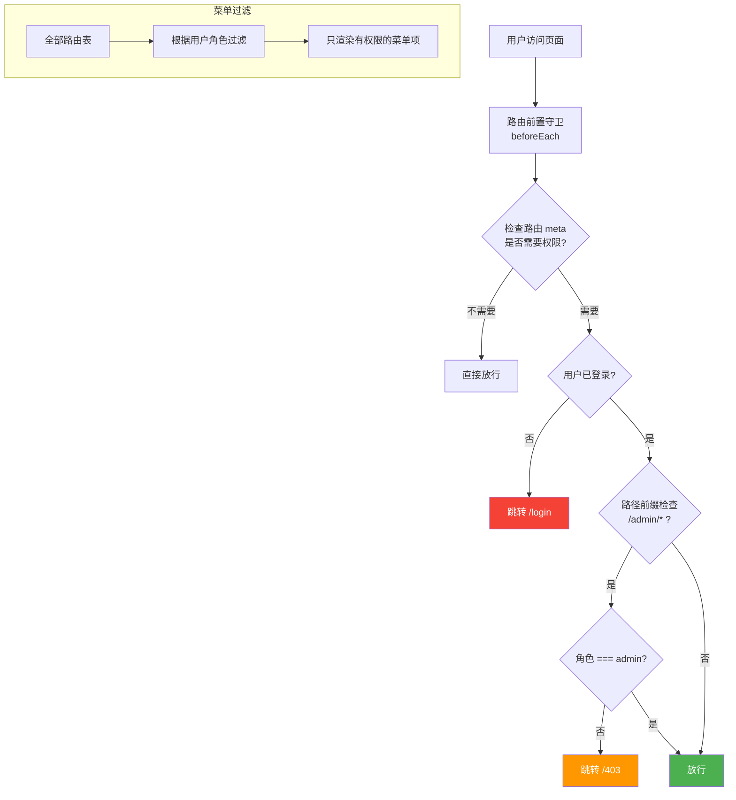

  

**关键设计：**

- **`access.ts` 独立模块**：集中定义权限校验逻辑，与路由配置解耦

- **路径前缀判断**：`/admin/*` 路由需要管理员权限

- **菜单过滤**：在渲染导航菜单时，根据用户角色过滤路由项，只显示有权限的菜单

- **前后端一致**：后端也做了接口级权限校验，前端权限仅用于 UI 控制

  

---

  

### Q40: 你使用 vue-cropper 做图片编辑用到了哪些前端知识？

  

**答：**

  

1. **组件封装**：将 vue-cropper 封装为通用 `ImageEditor` 组件，通过 props 控制裁剪比例、旋转角度等

2. **ref 获取组件实例**：通过 `ref` 获取 cropper 实例，调用其提供的方法

3. **Blob 处理**：调用 `getCropBlob()` 获取裁剪后的二进制数据

4. **文件上传**：将 Blob 构造为 `FormData`，通过 Axios 上传

  

```typescript

const cropperRef = ref();

  

// 获取裁剪结果

function handleCrop() {

  cropperRef.value.getCropBlob((blob: Blob) => {

    const formData = new FormData();

    formData.append('file', blob, 'cropped.png');

    uploadpicture(formData);

  });

}

```

  

---

  

### Q41: Axios 你在项目中是怎么封装的？

  

**答：**

  

**封装层级：**

  

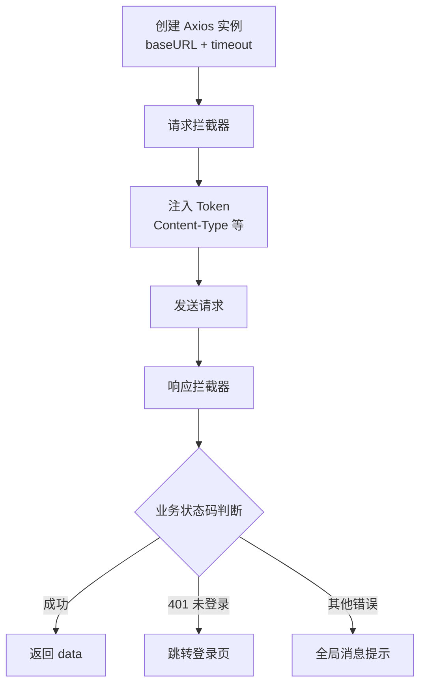

  

**关键实践：**

```typescript

const instance = axios.create({

  baseURL: '/api',

  timeout: 10000,

});

  

// 请求拦截器

instance.interceptors.request.use((config) => {

  const token = localStorage.getItem('token');

  if (token) {

    config.headers.Authorization = `Bearer ${token}`;

  }

  return config;

});

  

// 响应拦截器（处理精度丢失就是在这里发现问题的）

instance.interceptors.response.use(

  (response) => {

    const { code, data, message } = response.data;

    if (code === 0) return data;

    return Promise.reject(new Error(message));

  },

  (error) => {

    if (error.response?.status === 401) {

      router.push('/login');

    }

    return Promise.reject(error);

  }

);

```

  

---

  

### Q42: 流式文件下载你是怎么做的？为什么不用普通下载方式？

  

**答：**

  

**普通下载的问题：** 对于大文件，`window.open(url)` 或 `<a>` 标签下载，用户体验差（无进度显示），且无法在请求中携带 Token 做鉴权。

  

**Fetch API + Blob 流式下载：**

```typescript

async function downloadFile(appId: string) {

  const response = await fetch(`/api/app/download/${appId}`, {

    headers: { Authorization: `Bearer ${token}` },

  });

  

  // 从 Content-Disposition 解析真实文件名

  const disposition = response.headers.get('Content-Disposition');

  const fileName = disposition

    ? decodeURIComponent(disposition.split("filename*=UTF-8''")[1])

    : 'download.zip';

  

  // 创建 Blob 并下载

  const blob = await response.blob();

  const url = URL.createObjectURL(blob);

  const a = document.createElement('a');

  a.href = url;

  a.download = fileName;

  a.click();

  URL.revokeObjectURL(url); // 释放内存

}

```

  

**核心要点：**

- `URL.createObjectURL(blob)` 创建临时 URL 指向内存中的文件

- 使用后必须 `URL.revokeObjectURL()` 释放内存

- `Content-Disposition` 解析需处理 UTF-8 编码的中文文件名

  

---

  

### Q43: 你项目中前端模板是怎么搭建的？有哪些工程化考虑？

  

**答：**

  

**模板搭建过程：**

1. **create-vue + Vite** 初始化骨架项目

2. **全局布局组件** `BasicLayout.vue`：Header + Sidebar + Content 结构

3. **动态导航菜单**：根据路由配置自动生成，结合权限过滤

4. **通用组件**：`GlobalHeader.vue`、`GlobalFooter.vue`

  

**工程化配置：**

| 工具 | 作用 |

|------|------|

| ESLint | 代码质量检查（语法错误、未使用变量等） |

| Prettier | 代码格式统一 |

| TypeScript | 类型安全 |

| OpenAPI Codegen | 自动生成 API 层代码 |

| Vite | 快速热更新、按需编译 |

| 路径别名 `@` | `@/components/xxx.vue` 简化导入路径 |

  

**复用策略：** 模板设计为可迁移的基础架构，新项目只需修改路由配置和业务页面即可。

  

---

  

### Q44: Vue 3 中 key 的作用是什么？为什么不建议用 index 作为 key？

  

**答：**

  

`key` 是 Vue 虚拟 DOM **diff 算法**中用于识别节点身份的唯一标识。

  

**key 的作用：**

1. 帮助 diff 算法**精确匹配**新旧节点，决定哪些节点可以复用

2. 避免就地复用（in-place patch）导致的 **状态错乱**

  

**为什么不用 index：**

```

// 初始列表

[A, B, C]  → key: [0, 1, 2]

  

// 在头部插入 D

[D, A, B, C] → key: [0, 1, 2, 3]

  

// Vue 认为 key=0 对应的元素从 A 变成了 D

// 导致 A、B、C 全部 "更新"，而不是复用

```

  

用**唯一 ID** 作为 key 时，diff 算法能正确识别新增节点，只插入 D 即可。

  

---

  

### Q45: 你了解前端性能优化有哪些方案？在项目中做了哪些？

  

**答：**

  

```mermaid

mindmap

  root((前端性能优化))

    网络层

      CDN 加速

      HTTP/2 多路复用

      资源压缩 Gzip/Brotli

      DNS 预解析

    资源加载

      图片懒加载

      路由懒加载 import()

      预加载 prefetch/preload

      Tree Shaking

    渲染优化

      虚拟列表

      防抖节流

      减少回流重绘

      requestAnimationFrame

    构建优化

      代码分割 Code Splitting

      按需导入组件

      Vite 生产优化

    缓存策略

      HTTP 强缓存

      Service Worker

      localStorage 缓存

```

  

**项目中的实践：**

1. **路由懒加载**：`() => import('./pages/HomePage.vue')`

2. **Ant Design Vue 按需引入**：减少打包体积

3. **图片处理优化**：使用 COS 对象存储 + CDN 加速图片加载

4. **Vite 构建优化**：开发环境 HMR 热更新，生产环境 Tree Shaking + Gzip

5. **防抖节流**：搜索框输入使用 debounce，滚动加载使用 throttle

  

---

  

## 💡 面试技巧总结

  

1. **STAR 法则回答项目题**：Situation（背景）→ Task（任务）→ Action（行动）→ Result（结果）

2. **主动关联**：回答基础题时主动提一句"在我项目中是这样用的..."

3. **不会就承认**：比胡说好得多，可以说"这块我了解有限，但我的思路是..."

4. **反问环节准备**："团队的技术栈和前端架构是怎样的？" / "有没有 Code Review 机制？"