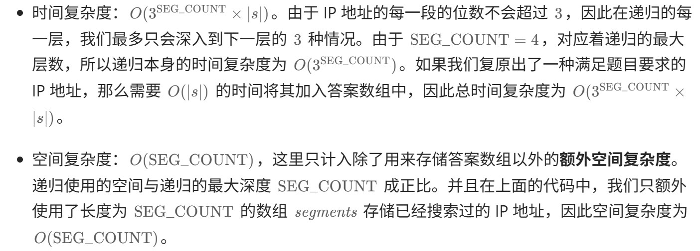

==ACM模式输入输出模版==
```javascript
const fs = require('fs');

// --- 第一步：这是你熟悉的 LeetCode 写法 ---
// 你就当这里是力扣的编辑器，完全不用管输入怎么来的
function twoSum(a, b) {
    return a + b;
}

// --- 第二步：这是你需要背下来的“壳” ---
function main() {
    // 1. 读数据（死记硬背）
    const input = fs.readFileSync(0, 'utf-8');
    const tokens = input.trim().split(/\s+/);
    let cur = 0;
    const nextInt = () => parseInt(tokens[cur++]);

    // 2. 准备参数（把数据喂给你的函数）
    // 假设题目说是一组测试数据，两个数
    const a = nextInt();
    const b = nextInt();

    // 3. 调用你的 LeetCode 函数并打印
    const ans = twoSum(a, b); 
    console.log(ans);
}

main();
```

1. 无重复字符的最长子串
采用**滑动窗口（双指针）+ 哈希集合**，左指针遍历字符串作为窗口左边界，右指针尽可能扩展窗口右边界（确保窗口内无重复字符），同时更新最长无重复子串长度，最终得到结果。
注意：右边界初始值为-1
`时间复杂度：O(N) `

2. 比较版本号
采用**双指针**逐段解析版本号，以小数点为分隔符，分别提取两个版本号的对应段并转换为整数进行比较，若某一段数值不等则直接返回比较结果，全部段相等则返回0
`时间复杂度：O(n+m)    空间复杂度：O(1)`

3. 合并两个有序数组
采用逆向双指针（从后往前填充），避免覆盖nums1有效元素，对比两个数组末尾的有效元素，将较大值放入nums1的末尾空闲位置，最终完成两个有序数组的合并
`时间复杂度：O(m+n)     空间复杂度：O(1)`

4. 有效的括号
采用**栈+哈希表**校验括号合法性，哈希表存储右括号与对应左括号的映射，遍历字符串时左括号入栈，遇到右括号则校验栈顶是否为匹配的左括号（不匹配直接返回false，匹配则出栈），最终通过栈是否为空判断所有括号是否完全匹配
注意：需要提前拦截奇数长度的字符串
`时间复杂度：O(n)       空间复杂度：O(n+6)`

5. 字符串相加
采用**逆向双指针模拟竖式加法**，从两个数字字符串的末尾开始逐位相加，维护进位值处理超 10 进 1 的情况，逐位记录相加结果，最后反转结果并拼接为字符串得到最终和。
注意：使用charCodeAt()可以降低执行用时
`时间复杂度：O(max(len1,len2))    空间复杂度：O(1)`

6. 两数之和
采用**哈希表（Map / 对象）+ 单次遍历**，遍历数组时记录已访问元素的「数值 - 索引」映射，对每个元素计算其与目标值的补数，若补数已在哈希表中则直接返回补数索引和当前索引，否则将当前元素存入哈希表
`时间复杂度：O(n)       空间复杂度：O(n)`

7. 全排列
采用**回溯 + 原地交换**的方式，通过`first`参数固定排列的当前位置，从该位置开始遍历并交换元素生成不同排列分支，递归处理下一个位置，递归返回后撤销交换恢复数组状态，直到所有位置都确定（`first`等于数组长度），将当前排列深拷贝存入结果集，最终得到数组的所有全排列。
`时间复杂度：O(n*n!)       空间复杂度：O(n)`

8. 反转链表
迭代：通过**双指针 + 循环**，用 prev 记录当前节点的前驱节点，curr 遍历链表，每次先保存 curr 的后继节点，再将 curr 的 next 指向 prev，随后更新 prev 和 curr 指针，逐步反转链表指向，最终 prev 成为反转后的头节点。
`时间复杂度：O(n)       空间复杂度：O(1)`

递归：采用**拆解子问题 + 回溯调整**，先递归拆解到链表最后一个节点（作为新头节点），再从后往前让当前节点的下一个节点指向自己，同时将当前节点的 next 置空，最终返回新头节点完成链表反转。
`时间复杂度：O(n)       空间复杂度：O(n)`


9. 二叉树的层序遍历
使用res数组保存结果，queue搭配while循环，每进行一次循环都是对当前层的节点进行遍历。
在while循环内部使用for循环，每取出一个节点就往队列中添加他的左右子节点（存在则添加，不存在不添加），同时将该节点的值push到`res[res.length-1]`中
`时间复杂度：O(n)       空间复杂度：O(n)`

10. 最大子数组和
遍历数组时，用prev维护以当前元素结尾的子数组的最大和（决策是否加入前一个子数组），同时用max记录遍历过程中所有prev的最大值，最终max为最大子数组和
`时间复杂度：O(n)       空间复杂度：O(1)`

11. 三数之和
先对数组排序，for循环遍历固定每个数作为三元组第一个数（跳过重复数），while循环再在其右侧区间用双指针（左指针右移找更大数、右指针左移找更小数）找和为该数相反数的两个数，找到后跳过重复数继续查找，最终收集所有不重复的三元组
$$
时间复杂度：O(n^2)           空间复杂度：O(logN)
$$

12. 买卖股票的最佳时机
遍历价格数组时，用minPrice动态记录遍历到当前位置的最低价格，同时用maxProfit计算当前价格与minPrice的差值，始终保留最大的差值作为最大利润，最终得到全局的最大收益
注意：minPrice初始值为Infinity，maxProfit初始值为0
`时间复杂度：O(n)       空间复杂度：O(1)`

13. 环形链表
采用快慢指针遍历链表，慢指针每次走一步、快指针每次走两步，若链表存在环则快慢指针最终会相遇，若快指针先走到链表末尾（null）则说明无环
`时间复杂度：O(n)       空间复杂度：O(1)`

14. 路径总和
- 采用**层序遍历（广度优先）+ 双队列**，用节点队列遍历二叉树节点，同步用路径和队列记录从根到当前节点的路径和，遍历到叶子节点时校验路径和是否等于目标值，匹配则返回 true，遍历完所有节点未匹配则返回 false。
`时间复杂度：O(n)       空间复杂度：O(n)`

- 采用**递归（深度优先）+ 问题拆解**，将目标和逐步减去当前节点值后，递归校验左 / 右子树是否存在从当前节点到叶子的路径和等于剩余值，叶子节点直接判断自身值是否匹配剩余目标和，空节点则返回 false。
`时间复杂度：O(n)       空间复杂度：O(h) h为树的高度`

15. LRU缓存机制
使用双向链表和哈希表，哈希表存储（key，node）键值对，node包含key，value，prev，next。该双向链表还需要设置伪头部和伪尾部，这样在添加节点和删除节点的时候就不需要检查相邻的节点是否存在。
在LRUCache的构造函数中，定义了createLinkedNode、addToHead、moveToHead
、removeNode、removeTail五个实例方法；cache是保存键值对的哈希表，capacity是容量，size是缓存目前被占用的大小，head和tail是链表的伪头伪尾。

对于 get 操作，首先判断 key 是否存在：如果 key 不存在，则返回 −1；如果 key 存在，则 key 对应的节点是最近被使用的节点。通过哈希表定位到该节点在双向链表中的位置，并将其移动到双向链表的头部，最后返回该节点的值。

对于 put 操作，首先判断 key 是否存在：
如果 key 不存在，使用 key 和 value 创建一个新的节点，在双向链表的头部添加该节点，并将 key 和该节点添加进哈希表中。然后判断双向链表的节点数是否超出容量，如果超出容量，则删除双向链表的尾部节点，并删除哈希表中对应的项；
如果 key 存在，先通过哈希表定位，再将对应的节点的值更新为 value，并将该节点移到双向链表的头部。

`时间复杂度：对于put和get都是O(1)      空间复杂度：O(capacity)`

16. 合并两个有序链表
采用**虚拟头节点的迭代算法**，用 prev 指针遍历两个有序链表，每次将值更小的节点接在 prev 后并移动对应链表指针，遍历完后将未遍历完的链表剩余部分接在末尾，最终返回虚拟头节点的下一个节点即为合并后的有序链表。
`时间复杂度：O(n+m)       空间复杂度：O(1)`

17. 爬楼梯
利用**动态规划 + 迭代优化空间**，基于 “第 n 阶台阶的走法数 = 第 n-1 阶 + 第 n-2 阶走法数” 的递推关系，用两个变量滚动记录前两阶的走法数，迭代计算到第 n 阶，避免递归的重复计算和额外空间消耗。
`时间复杂度：O(n)       空间复杂度：O(1)`

18. 最长回文子串
以字符串每个字符为奇数长度回文的中心、每两个相邻字符为偶数长度回文的中心，通过中心扩展函数向左右延伸找最长回文子串，记录最长回文的起止下标，最终截取对应子串。
```javascript
//扩展函数
function expand(s,left,right)
```
$$
时间复杂度：O(n^2)           空间复杂度：O(1)
$$

19. 数组中的第K个最大元素
采用**快速选择算法**，随机选取基准值将数组划分为大于、等于、小于基准值的三部分，根据 k 与大于基准值数组长度的关系递归缩小查找范围，若 k 落在等于区间则直接返回基准值，高效找到第 k 大元素。
```javascript
//快速选择函数
const quickSelect(numList,k)
```
$$
时间复杂度：O(n)           空间复杂度：O(logN)
$$

20. 手撕快速排序
该快速排序算法的核心思路可拆解为「先优化判断、再分区、最后递归」三步：

-  **递归排序函数（quickSort）**：接收待排序子数组的左右边界`left/right`，首先遍历子数组判断是否已有序 —— 若所有元素升序则直接返回（避免无意义递归）；若无序则调用分区函数找到基准值的最终下标，再递归对基准值左侧（≤基准）、右侧（≥基准）的子数组重复执行排序逻辑；
- **分区函数（partition）**：是核心步骤，先在`[left, right]`范围内随机选一个基准值并交换到子数组左端（避免有序数组导致算法退化），再用相向双指针（左指针`i`从`left+1`右移找≥基准的元素，右指针`j`从`right`左移找≤基准的元素），交换指针指向的元素以维持「左≤基准、右≥基准」的规则，直到指针相遇 / 交叉；最后将左端的基准值交换到指针`j`的位置（基准最终归位），返回基准下标；
-  **整体流程**：入口函数调用`quickSort`处理整个数组，通过「有序判断优化 + 随机基准分区 + 递归排序子数组」完成整体升序排序，且所有操作均在原数组上进行（原地排序）。

### 关键记忆点（写代码时的核心步骤）

- 写`quickSort`：先判有序→无序则分区→递归左右；
- 写`partition`：随机选基准换左端→双指针相向遍历交换→基准归位`j`并返回；
- 双指针规则：`i`找≥基准、`j`找≤基准，交换后指针各走一步，`i≥j`时停止；
- 基准归位：必须和`j`交换（而非`i`），避免下标越界或分区失效。

搭好`sortArray`→`quickSort`→`partition`的函数结构

$$
时间复杂度：O(NlogN)           空间复杂度：O(logN)
$$

21. 螺旋矩阵
该算法通过维护上下左右四个边界，按「上→右→下→左」的顺序循环遍历矩阵并收集元素，直至收集完所有元素；**核心注意事项**：需在每轮方向遍历中检查是否已收集完所有元素并提前终止，否则非正方形矩阵 / 最后一圈遍历会出现重复添加元素或下标越界问题。还需要考虑数组为空的边界条件。
$$
时间复杂度：O(m*n)      空间复杂度：O(1)(不计输出数组)
$$

22. 岛屿数量
双层循环遍历网格发现陆地则计数 + 1，通过 DFS 递归向上下左右深度遍历，将该岛屿所有相连陆地标记为水域，避免重复计数，最终返回总计数。
在dfs函数中需要判断是否越界以及是否是陆地，如果越界或者是水域，就直接返回
$$
时间复杂度：O(m*n)      空间复杂度：O(m*n)
$$

23. 合并区间
该算法先处理空区间数组的边界场景，再将所有区间按左端点升序排序，随后遍历排序后的区间，若结果数组为空或当前区间与结果数组最后一个区间无重叠（当前区间左端点大于最后一个区间右端点）则直接加入，否则合并（更新最后一个区间的右端点为两者最大值），最终得到无重叠的合并区间数组。
$$
时间复杂度：主要时间开销是排序的 O(nlogn)。

空间复杂度：O(logn) 为排序所需的空间复杂度。
$$

24. 最长上升子序列
该算法通过动态规划求解最长递增子序列长度：先处理空数组边界，构建 dp 数组（`dp [i]` 表示以 `nums [i] `结尾的最长递增子序列长度），初始化` dp [0]=1`，外层遍历每个位置 i 并初始化 `dp [i]=1`，内层遍历 i 之前的所有位置 j，若` nums [i]>nums [j]` 则更新 `dp [i] `为 `dp [j]+1` 的最大值，同时维护全局最长长度 max，最终返回 max 即为答案。

$$
时间复杂度：O(n^2)           空间复杂度：O(n)
$$

---
*2.21*

25. 二分查找
初始化左右指针指向数组首尾，在`left<=right`的循环中计算中间下标`mid`，比较目标值与中间元素，若相等则返回`mid`；若目标值更大则将左指针移至`mid+1`，更小则将右指针移至`mid-1`，循环结束未找到则返回 - 1，实现有序数组中高效查找目标值下标。
$$
时间复杂度：O(logn)           空间复杂度：O(1)
$$

26. 求根到叶子节点数字之和
该递归解法通过深度优先搜索（DFS）遍历二叉树，递归函数接收当前节点和路径累积数值，将累积值更新为`prevSum*10 + 当前节点值`，若为叶子节点则返回该累积值，否则递归计算左右子树的路径和并相加，最终返回所有根到叶子节点的路径数值之和。

该非递归解法采用广度优先搜索（BFS），借助两个队列分别存储遍历的节点和对应路径累积数值，初始化时将根节点和根节点值入队，遍历队列时取出节点和数值，若为叶子节点则累加数值到总和，否则将左右子节点及更新后的路径数值（`当前数值*10 + 子节点值`）入队，最终得到所有根到叶子节点的路径数值之和。
$$
两种解法的时间空间复杂度一样：
时间复杂度：O(n)           空间复杂度：O(n)
$$

27. 复原IP地址
该算法采用深度优先搜索（DFS）+ 回溯的思路复原合法 IP 地址：先定义 4 段 IP 的固定长度常量，用数组存储每段数值，递归函数接收「当前拆分段数 segId、字符串起始拆分位置 segStart」，递归中先判断终止条件（拆完 4 段且遍历完字符串则收集结果，未拆完但字符串遍历完则回溯）；再处理前导零特殊情况（当前位为 0 则该段只能是 0，直接递归下一段）；常规情况枚举 1-3 位数字计算段值，验证≤255 则记录该段并递归下一段，最终返回所有合法 IP 组合。

### 核心记忆点（写代码的关键步骤）

1. 初始化：定义`SEG_COUNT=4`、存储段值的`segments`数组、结果数组`ans`；
2. 递归函数（dfs）：
    
    - 终止条件：`segId===4`时，若`segStart===s.length`则拼接结果；`segStart===s.length`直接返回；
    - 前导零处理：当前位为 0 则该段设为 0，递归下一段并返回；
    - 枚举验证：循环计算 1-3 位段值，≤255 则记录段值并递归下一段，超范围则 break；
3. 初始调用`dfs(s,0,0)`，返回结果数组。



---
*2.22*

28. 零钱兑换
该算法采用动态规划求解最少硬币数：先初始化 dp 数组（`dp [i]` 表示凑成金额 i 所需最少硬币数），将` dp [0]` 设为 0、其余初始化为 amount+1（代表不可达），通过双层循环遍历每个金额和每种硬币，若当前硬币面额≤金额则更新 `dp [i] `为`「当前值」`与`「dp [i - 硬币面额]+1」`的最小值，最终若 `dp [amount] `超过 amount 则返回 - 1（无法凑成），否则返回` dp [amount]` 即为最少硬币数。
### 核心记忆点（写代码关键）
	1. 初始化：dp 数组长度为 amount+1，dp [0]=0，其余填 amount+1（作为 “无穷大” 标记）；
	2. 状态转移：对每个金额 i，遍历硬币，若硬币≤i 则 dp [i] = min (dp [i], dp [i-coin]+1)；
	3. 结果判断：dp [amount]>amount 则返回 - 1，否则返回 dp [amount]。

$$
时间复杂度：O(Sn)空间复杂度：O(S)
$$
`S是金额，n是面额数`

29. 括号生成
该算法采用深度优先搜索（DFS）+ 回溯生成有效括号组合：递归函数接收当前括号字符串、已用左 / 右括号数和目标对数 n，终止条件为字符串长度达 2n 时将其加入结果；递归中优先添加左括号（左括号数 < n 时），再添加右括号（右括号数 < 左括号数时），通过约束左右括号的添加规则保证组合有效，最终返回所有合法括号组合。
### 核心记忆点（写代码关键）
	1. 递归参数：当前字符串cur、左括号计数left、右括号计数right、目标对数n；
	2. 终止条件：cur.length === 2*n（括号总数为 2n），收集结果；
	3. 递归规则：先加左括号（left<n），再加右括号（right<left），确保括号有效；
	4. 初始调用：dfs("",0,0,n)，从空字符串、0 个左右括号开始递归。

$$
空间复杂度：O(n)
$$

30. 链表中倒数第k个节点
该算法采用双指针法找链表倒数第 k 个节点：先让右指针从表头向右走 k 步，再让左右指针同步向右移动，当右指针走到链表末尾（null）时，左指针恰好指向链表的倒数第 k 个节点，利用固定长度为 k 的指针窗口实现一次遍历找到目标节点。
### 核心记忆点（写代码关键）
	1. 初始化：左右指针均指向链表头节点；
	2. 第一步：右指针单独走 k 步，拉开与左指针 k 个节点的距离；
	3. 第二步：双指针同步走，直到右指针为 null，此时左指针即为目标节点；

$$
时间复杂度：O(n)空间复杂度：O(1)
$$

---
*2.23*

31. 二叉树的最大深度
该递归解法通过深度优先遍历二叉树，若当前节点为空则返回深度 0，否则递归计算左、右子树的最大深度，取两者最大值并加 1（当前节点层），最终返回整棵树的最大深度。
$$
时间复杂度：O(n)空间复杂度：O(height)
$$
该 BFS 解法借助队列实现二叉树的层序遍历，初始化队列并加入根节点，每次遍历当前队列中所有节点（即一层节点），将该层节点的左右子节点入队后深度加 1，循环至队列为空，最终的深度即为二叉树的最大深度。
$$
时间复杂度：O(n)空间复杂度：最坏情况下达到O(n)
$$

32. 二叉树的中序遍历
该递归解法通过深度优先搜索实现二叉树中序遍历：定义递归函数，若节点为空则返回，先递归遍历左子树，再将当前节点值加入结果数组，最后递归遍历右子树，以此遵循「左→根→右」的中序遍历规则。

该迭代解法借助栈模拟递归过程实现中序遍历：外层循环持续遍历至节点为空且栈空，内层循环先将当前节点及所有左子节点入栈，弹出栈顶节点（当前根节点）并记录值，再将指针指向其右子节点，通过栈的入栈出栈模拟「左→根→右」的遍历顺序。
$$
时间复杂度：O(n)空间复杂度：O(n)
$$

33. 斐波那契数列
先处理 n<2 的边界情况直接返回 n，再用`prevPrev`（f(n-2)）、`prev`（f (n-1)）两个变量滚动更新，循环计算当前项`curr = (prevPrev + prev) % 1000000007`，最终返回第 n 项值
$$
时间复杂度：O(n)空间复杂度：O(1)
$$

34. 岛屿的最大面积
这道题思路和岛屿数量基本一致
该算法基于深度优先搜索（DFS）求解岛屿最大面积：遍历网格中的每个单元格，若发现未访问的陆地（值为 1），则通过 DFS 递归遍历该陆地的上下左右所有连通陆地，累加统计当前岛屿的面积，同时维护全局变量记录所有岛屿的最大面积，遍历过程中通过将访问过的陆地置 0 标记已访问，避免重复计算。

$$
时间复杂度：O(m*n)空间复杂度：O(m*n)
$$

---
*2.24*

35. 接雨水
双指针从数组首尾向中间遍历，维护左右侧最大高度，每次选「较小的最大高度侧」计算当前指针位置接水量（该侧最大高度 - 当前高度），算完移动该侧指针，核心是 “较小侧的最大高度即为当前位置接水的短板，无需关注另一侧真实最大高度（仅需知道其≥当前短板）”，最终累加所有接水量即得结果。
### 核心记忆点（写代码关键）
	1. 初始化：左指针 0、右指针 len-1，左右 max=0，总雨水量 0；
	2. 循环：left<right 时，先更新左右 max（取自身 max 和当前指针高度的较大值）；
	3. 判断：左 max 小则算左指针接水量（左 max - 左高度），左指针 ++；否则算右指针（右 max - 右高度），右指针 --；
	4. 返回：总雨水量。

$$
时间复杂度：O(n)空间复杂度：O(1)
$$
36. 最长公共子序列
该算法采用动态规划求解最长公共子序列：构建 (m+1)×(n+1) 的 dp 数组（`dp [i][j]` 表示 text1 前 i 个字符和 text2 前 j 个字符的最长公共子序列长度），双层循环遍历两个字符串，若当前字符相等则` dp [i][j] `= `dp [i-1][j-1]+1`，否则取 `dp [i-1][j] `和 `dp [i][j-1] `的最大值，最终 `dp [m][n] `即为结果。
### 核心记忆点（写代码关键）
	1. 初始化：dp 数组维度 (m+1)×(n+1)，所有元素初始化为 0；
	2. 遍历：i 从 1 到 m、j 从 1 到 n，取 text1 [i-1] 和 text2 [j-1] 对比；
	3. 状态转移：字符相等则 “左上角值 + 1”，不等则 “左 / 上值取最大”；
	4. 返回：dp [text1 长度][text2 长度]。

$$
时间复杂度：O(m*n)空间复杂度：O(m*n)
$$

37. 最长公共前缀
该算法以数组第一个字符串为基准，逐字符遍历其每一位，对比其余所有字符串的同位置字符，若某位置字符不匹配或某字符串长度不足该位置，则返回基准字符串从 0 到该位置的子串作为最长公共前缀；若所有字符均匹配，返回基准字符串本身。

$$
时间复杂度：O(m*n)空间复杂度：O(1)
$$
`其中 m 是字符串数组中的字符串的平均长度，n 是字符串的数量`


38. 翻转二叉树
该递归解法通过深度优先遍历翻转二叉树：若根节点为空则返回 null，先递归翻转当前节点的左、右子树，再交换当前节点的左右子树引用，最终返回翻转后的根节点。
$$
时间复杂度：O(n)最坏空间复杂度：O(n)
$$
`空间复杂度：O(h)（树高）`

该迭代解法借助队列实现广度优先遍历翻转二叉树：先处理空节点边界，将根节点入队后循环遍历队列，每次取出队首节点交换其左右子树，再将非空的左右子节点入队，直至队列为空，返回翻转后的根节点。
$$
时间复杂度：O(n)最坏空间复杂度：O(n)
$$
`空间复杂度：O(w)（树宽）`


39. 千位分隔数
该算法为数字添加千分位分隔符：先处理 n=0 的特殊情况直接返回 "0"，再通过循环逐位取数字的最后一位拼接至结果字符串，每拼接 3 位且仍有未处理数字时(n>0)添加分隔符 "."，最后反转结果字符串得到带千分位分隔符的正确格式。
$$
时间复杂度：O(k)最坏空间复杂度：O(k)
$$
`k是数字的位数`

40. 不同路径
该算法用一维数组优化动态规划求解不同路径问题：先初始化长度为 n 的一维数组并全填 1（对应网格第一行路径数均为 1），再遍历网格第 2 行到第 m 行，逐列更新数组值（当前列值 = 自身值（上一行同列路径数） + 前一列值（当前行前一列路径数）），最终数组最后一个元素即为从左上角到右下角的总路径数。
### 核心记忆点（写代码关键）
	1. 初始化：arr = new Array(n).fill(1)；
	2. 外层循环：i从1到m-1（遍历除第一行外的所有行）；
	3. 内层循环：j从1到n-1`（遍历除第一列外的所有列）；
	4. 状态更新：arr[j] += arr[j-1]；
	5. 返回结果：arr[n-1]。

$$
时间复杂度：O(m*n)空间复杂度：O(n)
$$

---
*2.25*

41. 移动零
该算法用双指针法移动数组中的 0：初始化左右指针均指向数组起始位置，右指针遍历数组，遇到非 0 元素时交换左右指针位置的元素并右移左指针，右指针持续右移直至遍历结束，最终所有非 0 元素移至数组前部，0 自然归位后部。
*记住 “右指针找非 0，找到就和左指针交换，左指针只在交换后右移”*

$$
时间复杂度：O(n)空间复杂度：O(1)
$$

42. 二叉树的最近公共祖先
该算法通过后序递归遍历找二叉树两节点的最近公共祖先：递归至空节点或目标节点时直接返回该节点，否则递归遍历左右子树，若左右子树均返回非空节点则当前节点为最近公共祖先，若仅一侧返回非空则返回该侧结果
$$
时间复杂度：O(n)空间复杂度：O(h)
$$
空间复杂度最坏O(n)

---
*2.26*

43. 二叉树的锯齿形层次遍历
该算法采用层序遍历（BFS）实现二叉树的锯齿形层次遍历：先处理空节点边界，用队列存储待遍历节点，初始化遍历方向为从左到右，逐层遍历队列中节点，按当前方向（左→右用 push、右→左用 unshift）收集当前层节点值，遍历完一层后反转方向，最终将各层结果汇总返回。
$$
时间复杂度：O(n)空间复杂度：O(n)
$$
n为节点个数

44. K个一组翻转链表
该算法实现链表每 k 个节点一组反转，核心分 4 步：
	1. **初始化**：创建虚拟头节点 `dummy`，用 `preTail` 标记上一组尾节点（初始指向 `dummy`）；
	2. **分组检查**：循环中从 `preTail` 出发走 k 步找当前组尾节点 `curTail`，若节点数不足 k 则直接返回结果；
	3. **局部反转**：调用 `myReverse` 反转当前组（头 = head、尾 = curTail），得到反转后的新头、新尾；
	4. **拼接更新**：将反转后的组接回原链表（`preTail.next` 指向新头），更新 `head`（下一组头）和 `preTail`（当前组新尾），继续处理下一组。
$$
时间复杂度：O(n)空间复杂度：O(1)
$$

45. 两数相加
该算法遍历两个逆序存储数字的链表，逐位取节点值（**空节点补 0**）并累加进位值，首次创建节点时初始化新链表的头和尾指针，后续通过尾指针的 next 追加新节点，同时更新进位为累加和整除 10 的结果，遍历过程中仅当节点非空时才向后移动指针，遍历结束后需**额外判断进位是否大于 0**，若有则在新链表末尾追加存储该进位的节点，最终返回新链表头节点。
$$
时间复杂度：O(max(m,n))空间复杂度：O(1)
$$

---
*2.28*

46. 长度最小的子数组
该算法采用滑动窗口（双指针）思路，初始化左右指针均指向数组起始位置，通过右指针扩展窗口累加元素和，当窗口和≥目标值时收缩左指针以尝试缩小窗口长度并记录最小有效窗口长度，遍历结束后若未找到有效窗口则返回 0，否则返回最小长度。

**注意：初始最小长度设为`Number.MAX_SAFE_INTEGER`，需在最后判断是否仍为初始值（是则返回 0）**
$$
时间复杂度：O(n)空间复杂度：O(1)
$$


---
*3.1*

47. 字符串解码
该算法通过两个栈分别存储重复次数和对应前缀字符串，遍历字符串时逐字符处理：数字字符累积计算完整重复次数，遇到`[`时将当前次数和前缀字符串入栈并重置临时变量，遇到`]`时弹出栈顶次数和前缀，将当前字符串重复对应次数后拼接到前缀后，普通字符直接追加到当前字符串，最终得到解码后的完整字符串。
### 核心记忆点
	1. 双栈分工：numStack存重复次数（处理多位数），strStack存[前的前缀字符串，分工明确且一一对应；
	2. 数字处理：数字需通过num=num*10+parseInt(c)累积（避免单字符处理多位数出错），遇到[后重置为 0；
	3. 括号匹配逻辑：]触发拼接操作，先弹出次数和前缀，再将当前字符串重复后拼接到前缀，是解码的核心步骤；
	4. 临时变量：curString始终存储当前待重复的字符串，遍历中动态更新，最终直接返回该变量即可。

$$
时间复杂度：O(n)空间复杂度：O(n)
$$
n为解码后的字符串长度

48. 对称二叉树
**递归解法：**
通过定义辅助函数，判断两个节点是否同时为空（对称）、是否仅有一个为空（不对称），若均非空则需值相等且左节点的左子树与右节点的右子树对称、左节点的右子树与右节点的左子树对称，最终递归校验根节点的左右子树是否满足该对称规则。

**迭代解法：**
借助队列实现广度优先遍历，将需成对校验的节点（先根节点的左右子树，后续依次为左节点左 & 右节点右、左节点右 & 右节点左）依次入队，出队成对节点后校验是否对称（同时为空则跳过、仅一个为空 / 值不等则返回 false），全部校验通过则返回 true。

两种解法时间和空间复杂度一致
$$
时间复杂度：O(n)空间复杂度：O(n)
$$
n为二叉树节点个数


49. 最小栈
该算法通过主栈存储所有入栈元素，同时维护一个辅助最小栈（初始存入 Infinity），每次入栈时向最小栈追加当前主栈所有元素的最小值（取栈顶最小值与新元素的较小值），出栈时同步弹出最小栈栈顶元素，从而实现 O (1) 时间复杂度获取栈内最小值，同时保证 top、push、pop 操作也为 O (1)
$$
时间复杂度：O(1)空间复杂度：O(n)
$$
n为总操作数
差值法本质：**用 “当前值 - 入栈时最小值” 的差值替代辅助栈，通过数学计算反向推导原值和历史最小值**；
差值法的关键是抓住 “最小值的更新规律”—— 只有当新值比当前最小值小时，才需要更新 min，而差值能精准记录这个 “更小” 的关系，从而实现无辅助栈的 O (1) getMin。


---
*3.2*

50. 字符串相乘


51. 二叉树的右视图
该算法采用广度优先遍历（BFS）借助队列实现二叉树的层序遍历，遍历每一层时记录当前层节点总数，逐次出队节点并将左右子节点入队，仅当遍历到当前层最后一个节点时，将其值加入结果数组，最终得到二叉树的右视图（每层最右侧节点值的集合）。
$$
时间复杂度：O(n)空间复杂度：O(n)
$$

52. 打家劫舍
该算法采用动态规划的空间优化思路，通过两个变量滚动记录「前 i-2 间房屋的最大金额」和「前 i-1 间房屋的最大金额」，遍历数组时不断更新这两个变量（当前最大金额为 “偷第 i 间 + 前 i-2 最大金额” 和 “不偷第 i 间（即前 i-1 最大金额）” 的较大值），最终得到所有房屋可偷窃的最大金额，避免使用数组存储所有状态以节省空间。
$$
时间复杂度：O(n)空间复杂度：O(1)
$$


53. 相交链表
该算法采用双指针 “拼接路径” 的思路，初始化两个指针分别指向两个链表头节点，遍历中若指针到链表尾则跳转到另一链表头继续遍历，直到两指针相遇（相遇点即为相交节点），利用 “两指针遍历总长度相等（A 路径 + B 公共段 = B 路径 + A 公共段）” 的特性，无需计算链表长度即可找到相交节点，无相交则最终均指向 null 并返回。

$$
时间复杂度：O(m+n)空间复杂度：O(1)
$$

---
*3.3*

54. 最长重复子数组
该算法采用二维动态规划思路，构建 `(n+1)×(m+1)` 的 dp 数组（`dp[i][j]` 表示以 `nums1[i-1]` 和 `nums2[j-1]` 为结尾的最长重复子数组长度），双层遍历两个数组，若当前元素相等(`nums1[i] === nums2[j]`）则 `f[i+1][j+1] = f[i][j] + 1`（延续前序重复长度），否则保持 0，遍历中持续更新最大重复长度，最终得到两个数组的最长重复子数组长度。
$$
时间复杂度：O(m*n)空间复杂度：O(m*n)
$$


55. 验证回文串
该算法通过双指针从字符串首尾向中间遍历，优先跳过非字母数字的无效字符，仅对比有效字符（统一转为小写），若所有对称的有效字符均相等则判定为回文，任意一对有效字符不相等则立即返回非回文。
/[a-zA-Z0-9]/.test(s[i])  判断`s[i]`是否是字母数字字符
toLowerCase() 字母转换成小写

$$
时间复杂度：O(n)空间复杂度：O(1)
$$

56. 从前序与中序遍历序列构造二叉树
先通过哈希表缓存中序遍历元素的索引以快速定位根节点，再递归划分前序 / 中序数组的左右子树区间，逐步构建出完整的二叉树，递归终止条件为区间左边界超过右边界时返回 null。
$$
时间复杂度：O(n)空间复杂度：O(n)
$$
57. 删除链表的倒数第N个节点
借助虚拟头节点规避边界问题，让快指针先行 n 步后，快慢指针同步遍历至快指针到链表尾部，此时慢指针指向倒数第 n 个节点的前驱，直接修改其 next 指向即可删除目标节点。
58. 打乱数组
59. 二叉树的前序遍历
60. 最小路径和

